# CKAN Google Analytics Extension

**Status:** Production

**CKAN Version:** >= 2.7

A CKAN extension that both sends tracking data to Google Analytics and
retrieves statistics from Google Analytics and inserts them into CKAN pages.

## Features


* Puts the Google Analytics asynchronous tracking code into your page headers
  for basic Google Analytics page tracking.

* Adds Google Analytics Event Tracking to resource download links, so that
  resource downloads will be displayed as Events in the Google Analytics
  reporting interface.

* Adds Google Analytics Event Tracking to some API calls so that usage of the
  API can be reported on via Google Analytics.

* Add Google Analytics Event Tracking function that can be used in any exstension
  to create your custom events tracking.

		ckanext.googleanalytics.plugin._post_analytics

## Installation


1. Install the extension as usual, e.g. (from an activated virtualenv):

		$ pip install -e  git+https://github.com/ckan/ckanext-googleanalytics.git#egg=ckanext-googleanalytics
		$ pip install -r ckanext-googleanalytics/requirements.txt

2. Edit your development.ini (or similar) to provide these necessary parameters:

		googleanalytics.id = UA-1010101-1
		googleanalytics.account = Account name (i.e. data.gov.uk, see top level item at https://www.google.com/analytics)
		googleanalytics.username = googleaccount@gmail.com
        googleanalytics.password = googlepassword

   Note that your password will probably be readable by other people;
   so you may want to set up a new gmail account specifically for
   accessing your gmail profile.

3. Edit again your configuration ini file to activate the plugin
   with:

		ckan.plugins = googleanalytics

   (If there are other plugins activated, add this to the list.  Each
   plugin should be separated with a space).

4. Finally, there are some optional configuration settings (shown here
   with their default settings)

		googleanalytics_resource_prefix = /downloads/
		googleanalytics.domain = auto
        googleanalytics.track_events = false
        googleanalytics.fields = {}
        googleanalytics.enable_user_id = false
        googleanalytics.download_handler = ckan.views.resource:download

   ``resource_prefix`` is an arbitrary identifier so that we can query
   for downloads in Google Analytics.  It can theoretically be any
   string, but should ideally resemble a URL path segment, to make
   filtering for all resources easier in the Google Analytics web
   interface.

   ``domain`` allows you to specify a domain against which Analytics
   will track users.  You will usually want to leave this as ``auto``;
   if you are tracking users from multiple subdomains, you might want
   to specify something like ``.mydomain.com``.
   See `Google's documentation
   <http://code.google.com/apis/analytics/docs/gaJS/gaJSApiDomainDirectory.html#_gat.GA_Tracker_._setDomainName>`_
   for more info.

   If ``track_events`` is set, Google Analytics event tracking will be
   enabled. *CKAN 1.x only.* *Note that event tracking for resource downloads
   is always enabled,* ``track_events`` *enables event tracking for other
   pages as well.*

   ``fields`` allows you to specify various options when creating the tracker. See `Google's documentation <https://developers.google.com/analytics/devguides/collection/analyticsjs/field-reference>`.

   If ``enable_user_id`` is set to ``true``, then logged in users will be tracked into the Google Analytics' dashboard.
   This way metrics can be tracked for every logged in user. You can read more
   about this feature and its benefits `here <https://support.google.com/analytics/answer/3123662>`_.

   When resource is downloaded, ckanext-googleanalytics posts event to
   GA and calls default download callback. If you are using CKAN>=2.9
   and some of your plugins redefines `resource.download`
   route(ckanext-cloudstorage, for example), you can specify which
   function must be called instead of `ckan.views.resource:download`
   via `ckanext.googleanalytics.download_handler` config variable. For ckanext-cloudstorage you can use:

		ckanext.googleanalytics.download_handler = ckanext.cloudstorage.views:download

# Domain Linking


This plugin supports cross-domain tracking using Googles' site linking feature.

To use this, set the ``googleanalytics.linked_domains`` configuration option to a (comma seperated) list of domains to report for.

See `Googles' documentation<https://support.google.com/analytics/answer/1034342?hl=en>`_ for more information

# Setting Up Statistics Retrieval from Google Analytics


1. Run the following command from ``src/ckanext-googleanalytics`` to
   set up the required database tables (of course, altering the
   ``--config`` option to point to your site config file):

		paster initdb --config=../ckan/development.ini

2. Optionally, add::

		googleanalytics.show_downloads = true

   to your CKAN ini file. If ``show_downloads`` is set, a download count for
   resources will be displayed on individual package pages.

3. Follow the steps in the *Authorization* section below.

4. Restart CKAN (e.g. by restarting Apache)

5. Wait a while for some stats to be recorded in Google

6. Import Google stats by running the following command from
   ``src/ckanext-googleanalytics``::

		paster loadanalytics credentials.json --config=../ckan/development.ini

   (Of course, pointing config at your specific site config and credentials.json at the
   key file obtained from the authorization step)
   Ignore warning `ImportError: file_cache is unavailable when using oauth2client >= 4.0.0`

7. Look at some stats within CKAN

   Once your GA account has gathered some data, you can see some basic
   information about the most popular packages at:
   http://mydomain.com/analytics/dataset/top

   By default the only data that is injected into the public-facing
   website is on the package page, where number of downloads are
   displayed next to each resource.

8. Consider running the import command reguarly as a cron job, or
   remember to run it by hand, or your statistics won't get updated.


## Authorization


Before ckanext-googleanalytics can retrieve statistics from Google Analytics, you need to set up the OAUTH details which you can do by following the `instructions <https://developers.google.com/analytics/devguides/reporting/core/v3/quickstart/service-py>`_ the outcome of which will be a file with authentication key. These steps are below for convenience:

1. Visit the `Google APIs Console <https://code.google.com/apis/console>`_

2. Sign-in and create a project or use an existing project.

3. In the `Service accounts pane <https://console.developers.google.com/iam-admin/serviceaccounts>`_ choose your project and create new account. During creation check "Furnish a new private key" -> JSON type. Write down "Service account ID"(looks like email) - it will be used later.

4. Save downloaded file - it will be used by `loadanalytics` command(referenced as <credentials.json>)

5. Go to `GoogleAnalytics console <https://analytics.google.com/analytics/web/#management>`_ and chose ADMIN tab.

6. Find "User management" button in corresponding column. Add service account using Service account ID(email) generated in 3rd step and grant "Read" role to it.


## Testing


There are some very high-level functional tests that you can run using::

	(pyenv)~/pyenv/src/ckan$ nosetests --ckan ../ckanext-googleanalytics/tests/

(note -- that's run from the CKAN software root, not the extension root)

## Future

This is a bare-bones, first release of the software.  There are
several directions it could take in the future.

Because we use Google Analytics for recording statistics, we can hook
into any of its features.  For example, as a measure of popularity, we
could record bounce rate, or new visits only; we could also display
which datasets are popular where, or highlight packages that have been
linked to from other locations.

We could also embed extra metadata information in tracking links, to
enable reports on particular types of data (e.g. most popular data
format by country of origin, or most downloaded resource by license)

## Integration Process for FCSC

1) change ckan/ckanext-googleanalytics to datopian/ckanext-googleanalytics in dockerfile
```
RUN pip install -e  git+https://github.com/datopian/ckanext-googleanalytics.git@ef65a390fe420f6cce6ff52ba51819272ab36373#egg=ckanext-googleanalytics && \
    pip install -r  https://raw.githubusercontent.com/datopian/ckanext-googleanalytics/fcsc/requirements.txt
```
2) update google-analytics config variables
3) download google service account credentials `credential.json`
4) store in `ckan/` in the deployment repo and update the dockerfile
```
COPY credentials.json ${APP_DIR}
```
6) add cron jobs to fetch analytics data and load them into the DB. this should be done manually at first so that the necessary table will be included when the package and resource page is loaded and to prevent error
To initally create the analytics table 
```
ckan -c ckan.ini googleanalytics init
```


## SETUP

1) Create GA4 account: Login into GA -> click on Admin -> click on create account -> select GA4 option

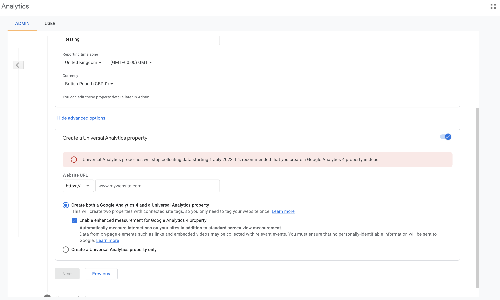

2) click on `Admin` again , then click on `Data Streams` to fetch the neccessary values

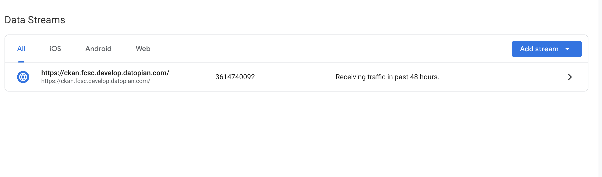

In data streams click on the forward arrow `>` beneath `Add stream`
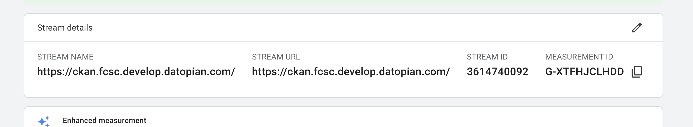

click on the copy icon beside `MEASUREMENT ID`

Add this value into `.env` e.g `CKAN___GOOGLEANALYTICS__MEASUREMENT_ID = G-XTFHJCLHDD`

Still on that page scroll down and click on `Measurement Protocol API secrets`  -> then click on create to create a new `api secret`


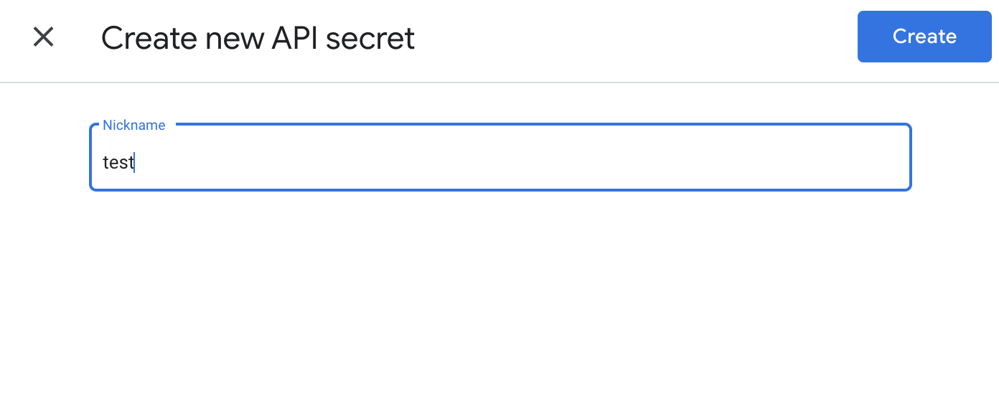
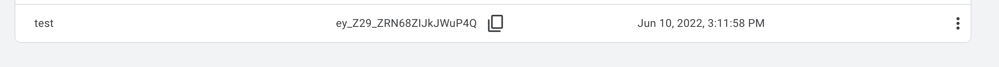
Then click on the copy Icon and paste the value in .env e.g `CKAN___GOOGLEANALYTICS__API_SECRET = BDU0P13TRG-VVwfF2DKTcQ`

3) In the Admin page -> click on `Property Setting` and copy the `PROPERTY ID`
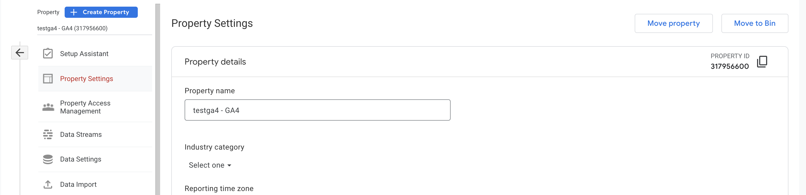

4) Next step is to create custom event: Go to Tag Manager

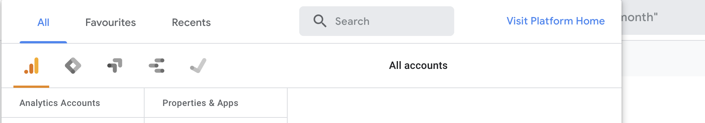

Click on `Tags` -> and then click new


Click on the pen icon -> and then choose `Google Analytics: GA4 Event`
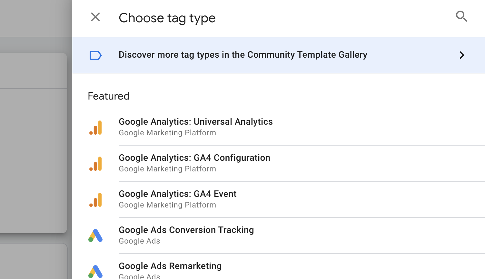

For `configuration Tag`: select the hihlighted field in the image below

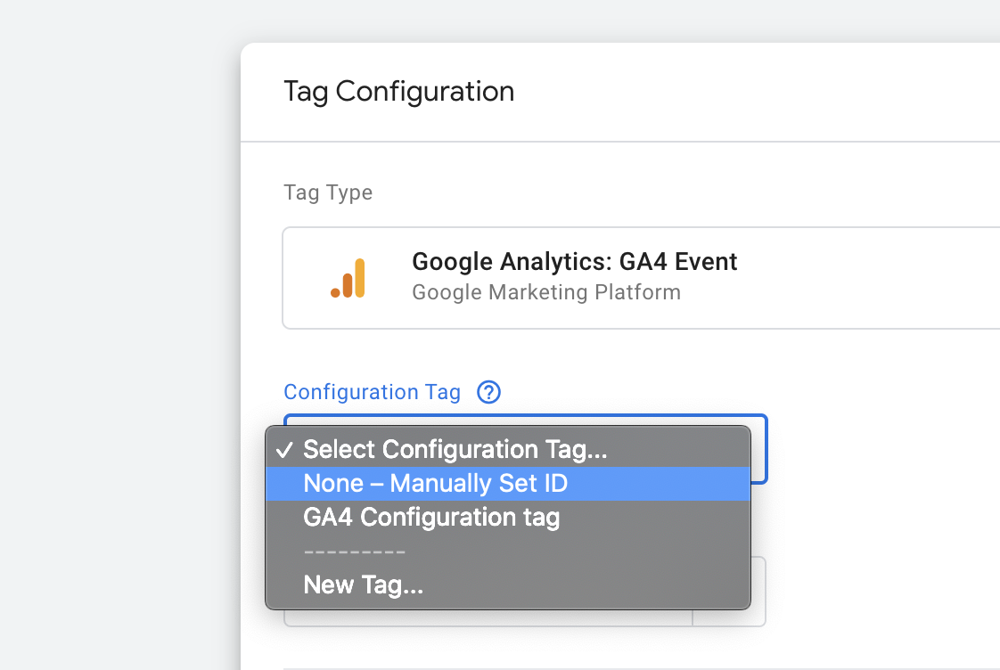

Add the measurement id you copied, and name your event `resource_download`

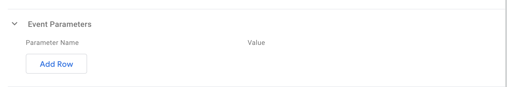

click on event parameters -> click Add row -> fill in the field has shown in the image
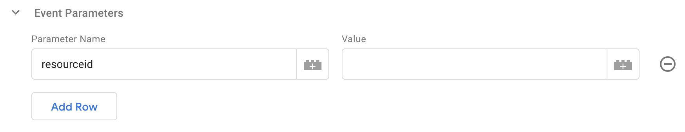

once the parameter Name is entered. We need to add value. since our values will be URL- we won't set it to `Page Url` or `Page path` to prevent adding redundant url. Hence we create custom value.

click on the plus button in `value` input field

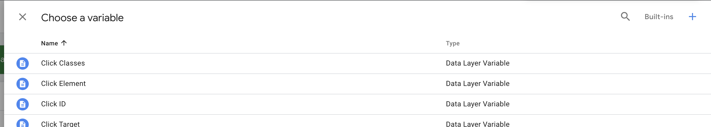

In the above image click on the `+` sign at the top right

Take your mouse over `Variable configuration` and click on the `pen` icon
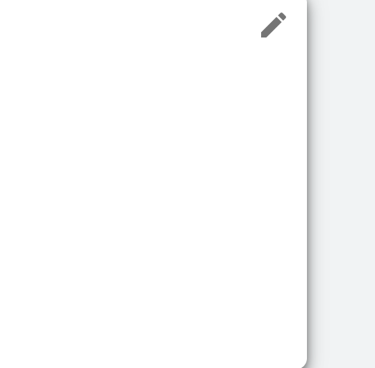

Scroll donw and click on `constant`

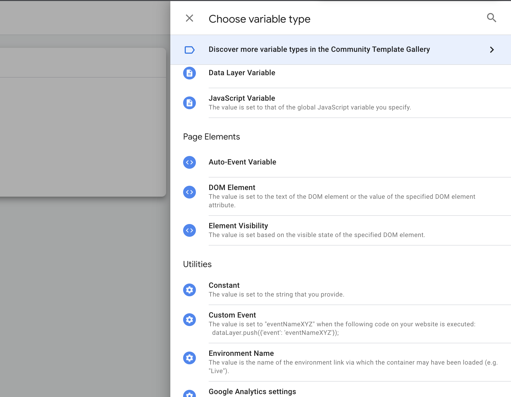

Give the constant value any name and click on save

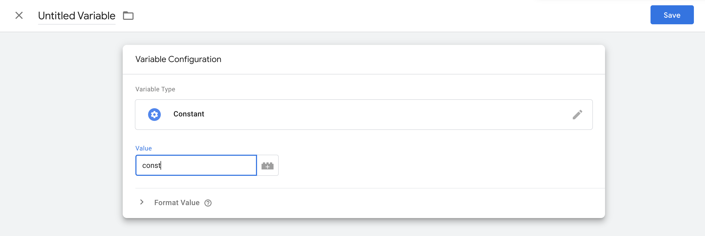

There will be a pop up on save. Tha name can be changed or left as it is. then click save.

This will lead you to the event page. The`Value` should be the name saved for the constant from the previous page.
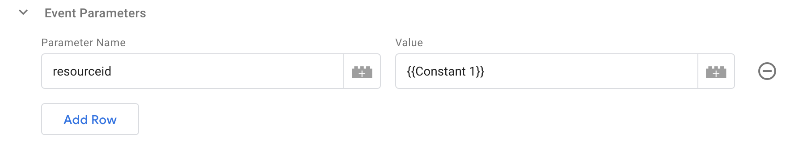

Then click save at the upper right of the page.


Then click on the save button. Click on save without trigger in the pop up.

Then even is created and ready to be used.


## Enviroment

At the end of the setup this are the neccessary env to be set
e.g

```
CKAN___GOOGLEANALYTICS__ACCOUNT =
CKAN___GOOGLEANALYTICS__PROPERTY_ID = 
CKAN___GOOGLEANALYTICS__MEASUREMENT_ID = 
CKAN___GOOGLEANALYTICS__API_SECRET = 
CKAN___GOOGLEANALYTICS__RECENT_VIEW_DAYS = 14 // should be send corresponding to the cron job
```


